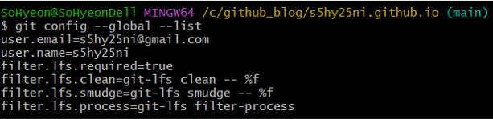
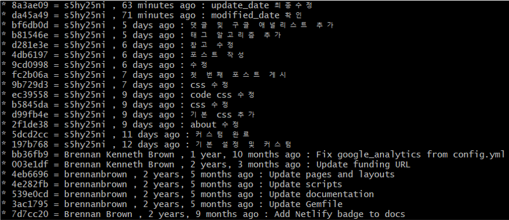
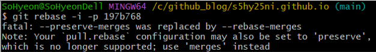
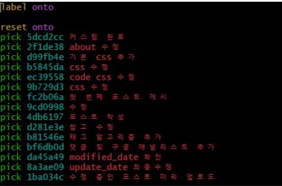
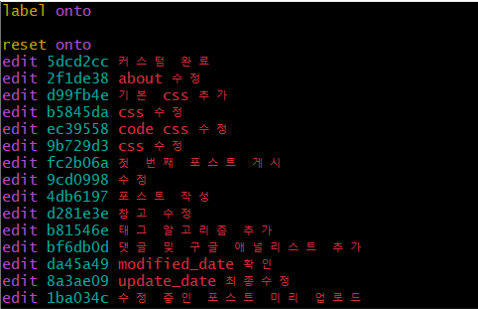
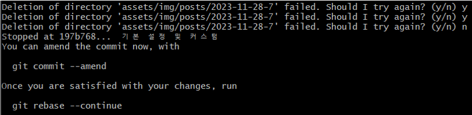
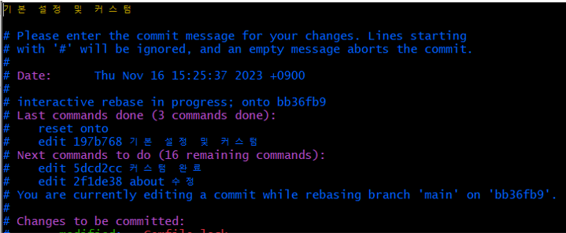
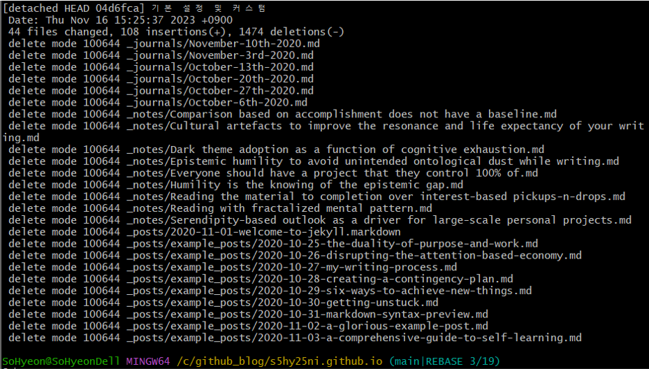
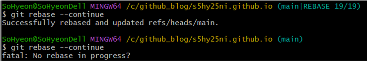
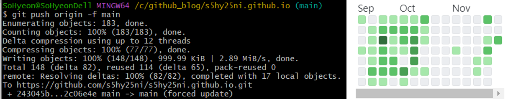

### 🌱 이슈 발생

github.io에 올린 포스트들 잔디가 안심어져있는 걸 확인했다. 
테마를 수정하면서 워낙 수정이 많았을 때라 그냥 커밋을 다른 날에 했나 싶었는데, 
오늘 올려보니 안심어진게 맞았음. 
블로그를 github.io로 시작한 이유는 잔디도 있기 때문에 고쳐야겠다고 생각했다.

 

### 🪴 참고
1. [[Git/Github] 깃허브 잔디 누락 현상](https://kdjun97.github.io/git-github/plant-grass/)
2. [github 잔디밭 안 심어지는 현상 해결 및 이미 커밋한 내용 반영하기](https://wellbell.tistory.com/43)
3. [[Github] private 레파지토리 잔디 반영 에러, rebase 시 -preserve-merges was replaced by --rebase-merges 에러 해결](https://crispy-dev.tistory.com/entry/Github-private-%EB%A0%88%ED%8C%8C%EC%A7%80%ED%86%A0%EB%A6%AC-%EC%9E%94%EB%94%94-%EB%B0%98%EC%98%81-%EC%97%90%EB%9F%AC-rebase-%EC%8B%9C-preserve-merges-was-replaced-by-rebase-merges-%EC%97%90%EB%9F%AC-%ED%95%B4%EA%B2%B0)

 

### 🌵 누락 원인
1. github 이메일 계정과 로컬의 이메일 정보가 다를 경우
2. branch가 `main` 혹은 `gh-pages`가 아닐 경우
3. forked repo에서 작업하여 merge가 되지 않았을 경우

 

### 🌴 해결
#### 1. 이메일 확인
  - github - Settings - Emails
    

  - git bash : `git config --global --list`
    

  - 나는 두 계정이 동일해서 넘어갔지만 만약 다르다면 아래 명령어로 수정해주면 된다. 
  `git config --global user.email "github emails 계정"`

 

#### 2. fork 연결 끊기
내 경우는 이 이유 때문이였다. 
github.io를 만들면서 테마 레포지토리를 fork 해왔는데, 이 레포에 작업을 하다보니 merge가 안돼서 잔디도 안 심어짐 
fork 연결 해제는 구글링 결과 레포지토리 삭제나 github에 문의하는 것 밖에 없어서 참고 블로그 중 1번에 나와있는 편법을 쓰기 했다. 

  1) 기존 github.io 레포지토리의 이름을 변경한다. 내 경우에는 `s5hy25ni.github.io`를 `_s5hy25ni.github.io`로 변경했다. 
  2) `_s5hy25ni.github.io`를 로컬에 `clone`한다. 기존에 작업하던 로컬 저장소가 있으면 생략. 
  3) 사용하는 github.io의 주소(`s5hy25ni.github.io`)로 새로운 레포지토리를 생성한다. 
  4) 2번에서 생성한 로컬 저장소(또는 기존 로컬 저장소)에서 `mirror push`를 한다. (`git push --mirror <_s5hy25ni.github.io 주소>`) 
  5) 새로 생성한 repo(`s5hy25ni.github.io`)에 commit log를 포함한 모든 작업물이 제대로 push 됐는지 확인한다.

그 뒤에는 본래 하던 것처럼 포스팅을 하면 잔디가 제대로 심어지고, 누락된 잔디는 3번을 따라하면 복원된다.

 

#### 3. 누락된 잔디 복원
1. git log로 복원할 해쉬 코드 확인
- `git log --pretty=format:"%h = %an , %ar : %s" --graph`
      

  
2. 해쉬코드로 rebase
- 복원하고자 하는 해쉬코드 바로 앞 해쉬코드를 선택해야 그 이후 해쉬코드부터 보이는 것 같다. 나는 `197b768` 부터 복원해야해서 `bb36fb9`를 입력했다. 아래 사진들은 `197b768`를 입력해서 그 다음 `5dcd2cc` 부터 나오고 있다.
- `git rebase -i -p 해쉬코드`
      

      위 방법으로 했을 경우 나는 이런 에러가 떴다. 
      `--preserve-merges`가 `--rebase-merges`로 대체되었다는 소리! 
      `-p` 옵션을 `-r`로 바꿔서 하면 된다. 
- `git rebase -i -r 해쉬코드` ⭐
      

      정상적으로 명령어가 실행되면 이런 창이 뜬다.
      `i` 키를 눌러 insert 모드로 바꾼 후, 복원할 해쉬코드들 앞의 `pick`을 `edit`으로 수정한다. `pick`은 유지, `edit`은 수정의 의미라고 생각하면 된다.
      

      나는 모든 commit이 반영이 안돼서 모두 `edit`으로 수정했다. 저장은 `esc` 키를 누른 후 `:wq!`를 입력한다. `w` 는 저장을, `q` 는 나가기를, `!` 는 강제 종료를 의미한다.
      

      잘 저장이 됐다면 위와 같은 문구(You can amend ~)가 뜬다.

3. 개정하기(반복)
- `git commit --amend --author="이름 <이메일>" ` : commit 작성자 기록
- `:q!` : 아래 화면에서 나가기를 입력하면 그 다음 화면이 뜨면서 rebase가 완료된다. `(main|REBASE 3/19)`으로 남은 commit 수를 확인할 수 있다.
      

      

- `git rebase --continue` : 다음 해쉬코드로 넘어간다.
- 이 작업들을 아래 문구(No rebase in progress?)가 뜰 때까지 반복하면 된다.
      

4. 원격 저장소로 강제 푸시
- `git push origin +브런치이름` 또는 `git push origin -f 브런치이름`
      

      push까지 완료하면 잔디가 이쁘게 복원된 것을 볼 수 있다 :) 
      더 푸릇푸릇해지게 노력해야겠다. 🌱🌱🌱
    