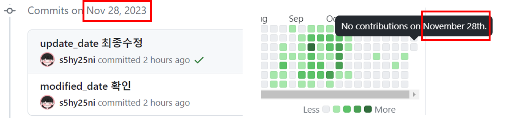
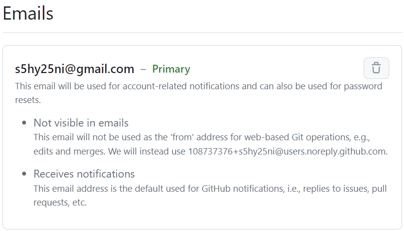
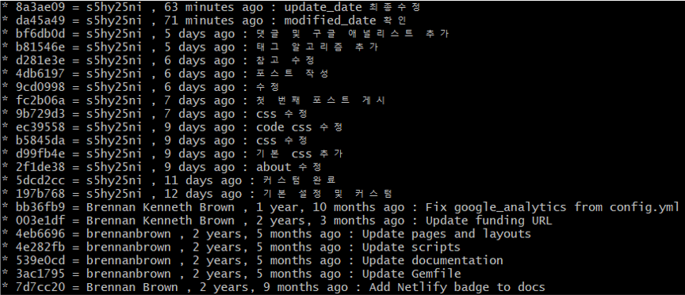

### 🌱 이슈 발생

github.io에 올린 포스트들 잔디가 안심어져있는 걸 확인했다. 
테마를 수정하면서 워낙 수정이 많았을 때라 그냥 커밋을 다른 날에 했나 싶었는데, 
오늘 올려보니 안심어진게 맞았음. 
블로그를 github.io로 시작한 이유는 잔디도 있기 때문에 고쳐야겠다고 생각했다.

 

### 🪴 참고
1. [[Git/Github] 깃허브 잔디 누락 현상](https://kdjun97.github.io/git-github/plant-grass/)
2. [github 잔디밭 안 심어지는 현상 해결 및 이미 커밋한 내용 반영하기](https://wellbell.tistory.com/43)
3. [[Github] private 레파지토리 잔디 반영 에러, rebase 시 -preserve-merges was replaced by --rebase-merges 에러 해결](https://crispy-dev.tistory.com/entry/Github-private-%EB%A0%88%ED%8C%8C%EC%A7%80%ED%86%A0%EB%A6%AC-%EC%9E%94%EB%94%94-%EB%B0%98%EC%98%81-%EC%97%90%EB%9F%AC-rebase-%EC%8B%9C-preserve-merges-was-replaced-by-rebase-merges-%EC%97%90%EB%9F%AC-%ED%95%B4%EA%B2%B0)

 

### 🌵 누락 원인
1. github 이메일 계정과 로컬의 이메일 정보가 다를 경우
2. branch가 `main` 혹은 `gh-pages`가 아닐 경우
3. forked repo에서 작업할 경우 merger가 되지 않았을 경우

 

### 🌴 해결
#### 1. 이메일 확인
  - github - Settings - Emails
    

  - git bash : `git config --global --list`
    

  - 나는 두 계정이 동일해서 넘어갔지만 만약 다르다면 아래 명령어로 수정해주면 된다. 
  `git config --global user.email "github emails 계정"`

 

#### 2. 누락된 잔디 복원
1. git log로 해쉬 코드 확인
  - `git log --pretty=format:"%h = %an , %ar : %s" --graph`
    

  
2. 해쉬코드로 rebase
  - `git rebase -i -p 해쉬코드`
      

      위 방법으로 했을 경우 나는 이런 에러가 떴다. 
      `--preserve-merges`가 `--rebase-merges`로 대체되었다는 소리! 
      `-p` 옵션을 `-r`로 바꿔서 하면 된다. 
     
  - `git rebase -i -r 해쉬코드`
