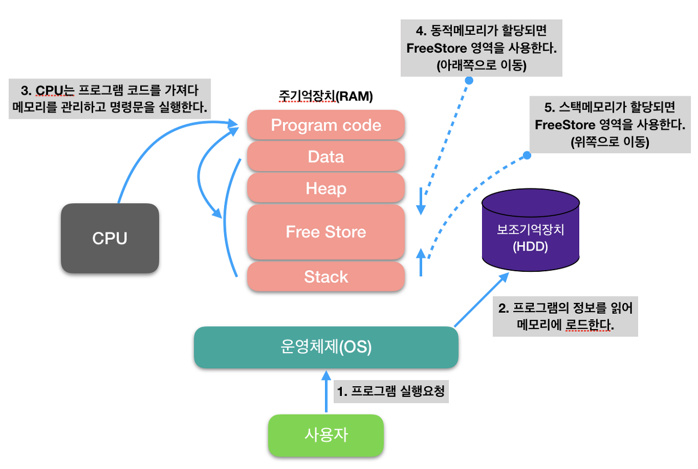
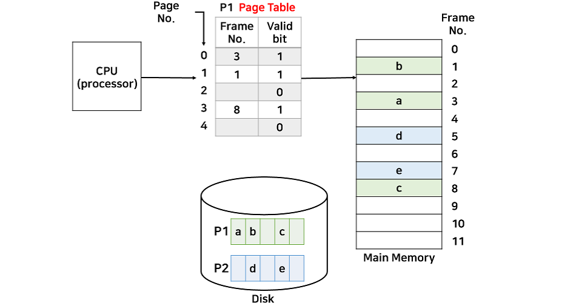

### ⭐ 참고
[[개발자 장고] 개발자 전공면접 준비 YOUTUBE](https://www.youtube.com/watch?v=SiObpQCTyFQ&list=PLi-xJrVzQaxU-xK2ao8utngQJqAX4DQty)

 

### 🌱 기본
- 전공 면접
  - 주어진 질문에 대해 2~3문장으로 미리 답변 작성 및 외우기
  - 내가 준비한 방향으로 면접관을 유도
  - 필수 과목 : 운영체제, 네트워크, 데이터베이스, 자료구조, 알고리즘, 디자인 패턴, 자바, 스프링, 웹
- 프로젝트 면접
  - 프로젝트 설명 2~3문장
  - 사용 기술스택 질문 리스트 : 사용 버전과 해당 버전 특징
  - 면접 이후 질문 기록하기
  - 해당 기술을 써본 적 있냐는 질문에는 써봤다 혹은 관심이 있어 공부했지만 적용은 못했다.
- 인성
  - 자기소개 및 마지막 할 말
  - 지원하는 기업의 서비스 및 지원동기
  - 비전공자라면 바꾼 이유
  - 협업 경험
  - 이전 직장 퇴사 이유 및 공백기

 

### ☑️ 운영체제
1. 운영체제란?
   - 시스템의 자원과 동작을 관리하는 소프트웨어
     - 시스템의 자원 : CPU, 메모리
   - 프로세스, 저장장치, 네트워킹, 사용자, 하드웨어를 관리
     - 프로세스 : 실행하는 프로그램들
     - 저장장치 : RAM, HDD

    ✏️ 운영체제는 시스템의 자원과 동작을 관리하는 소프트웨어로 프로세스, 저장장치, 네트워킹, 사용자, 하드웨어를 관리합니다.

2. 메모리(RAM) 구조
   - 메모리 공간 종류 : Code, Data, Heap, Stack
        
        
        
이미지 출처 : <a href="https://june-17.tistory.com/211">[OS] 메모리 구조(Memory Structure)</a>

      - 컴파일 : 이미 메모리가 얼마나 차지할지 결정되어 있음
      - 런타임 : 사용자가 사용하면서 크기가 결정

    ✏️ 메모리는 크게 Code, Data, Heap, Stack으로 구성되어 있습니다. Code는 소스코드가 저장되며, Data는 전역 및 정적 변수가 저장됩니다. Heap은 사용자가 직접 관리하는 영역으로 데이터가 동적으로 할당되는 영역입니다. Stack은 함수의 호출정보, 지역 및 매개 변수가 저장됩니다.

3. 프로세스, 스레드
   - 프로세스
     - 실행중인 프로그램
     - 각각 독립된 메모리 영역을 할당받는다.
     - 각 프로세스는 별도의 주소 공간에서 실행되며, 한 프로세스는 다른 프로세스의 변수나 자료구조에 접근할 수 없다.
     - 한 프로세스가 다른 프로세스의 자원에 접근하려면 프로세스 간의 통신(IPC, Inter-Process Communication)을 사용해야 한다.
   - 스레드
     - 프로세스 안 실행 단위
     - 한 프로세스 내에서 동작되는 실행 흐름 단위
     - 스레드는 프로세스 내에서 Stack만 따로 할당 받고, Code, Data, Heap 영역은 공유한다.

    ✏️ 프로세스는 실행중인 프로그램이고, 스레드는 프로세스 안에서 실행되는 흐름 단위 입니다. 프로세스는 메모리와 CPU를 독립적으로 할당받아 사용하며, 다른 프로세스의 변수나 자료구조에 접근할 수 없습니다. 스레드는 프로세스 안에서 다른 스레드와 메모리 및 CPU를 공유하며, Stack만 독립적으로 할당 받아 사용합니다.

4. CPU 스케줄러
   - 준비큐에 있는 프로세스에 대해 CPU를 할당하는 방법
   - 스케줄링 알고리즘
     - 비선점 스케줄링(Non-preemptive scheduling)
       - FCFS(First Come First Served) : 먼저 CPU를 요청하는 프로세스를 먼저 처리
       - SJF(Shortest Job First) : Burst Time(CPU에서 사용하는 시간)이 짧은 프로세스부터 CPU 할당
     - 선점 스케줄링(Preemptive scheduling)
       - SRT(Shortest Remaining Time) : 최단 잔여 시간을 우선으로 하며, 진행 중인 프로세스가 있어도 sleep시키고 짧은 프로세스를 먼저 할당
       - RR(Round Robin) : 모든 프로세스가 같은 우선순위를 가지며, time slice(time quantum)를 기반으로 스케줄링, Time slice burst가 일어나면 해당 프로세스는 스케줄링 큐의 끝으로 이동
       - Priority Scheduling(우선 순위 스케줄링) : 우선 순위가 높은 프로세스에 CPU를 우선 할당, 우선 순위는 시간 제한, 메모리 요구량, 프로세스의 중요성, 자원 사용 비용 등에 따라 달라질 수 있음

    ✏️ 준비큐에 있는 프로세스에 대해서 CPU를 할당하는 방법입니다. 비선점 스케줄링에는 FCFS, SJF가 있으며, 선점 스케줄링에는 SRT, Round Robin, 우선 순위 스케줄링이 있습니다.

5. 가상 메모리란?
   - 사용하는 부분만 메모리에 올리고, 나머지는 디스크에 보관
  
    
    
이미지 출처 : <a href="https://velog.io/@codemcd/%EC%9A%B4%EC%98%81%EC%B2%B4%EC%A0%9COS-15.-%EA%B0%80%EC%83%81%EB%A9%94%EB%AA%A8%EB%A6%AC">[운영체제(OS)] 15. 가상메모리</a>

    ✏️ 모든 프로세스에게 메모리를 할당하기에 메모리의 크기가 한계가 있어 사용하는 방법입니다. 프로세스에서 사용하는 부분만 메모리에 올리고, 나머지는 디스크에 보관하는 기법을 가상메모리라고 합니다.

6. 데드락이란?
   - 프로세스가 자원을 얻지 못해 다음 작업을 못하는 상태
   - 데드락 발생 조건 (동시 성립)
     - 상호 배제(Mutual exclusion) : 한 번에 프로세스 하나만 해당 자원을 사용할 수 있다.
     - 상호 대기(Hold and wait) : 자원을 최소한 하나 보유학, 다른 프로세스에 할당된 자원을 점유하기 위해 대기하는 프로세스가 존재해야 한다.
     - 비선점(No preemption) : 다른 프로세스에 할당된 자원은 사용이 끝날 때까지 강제로 빼앗을 수 없다.
     - 순환 대기(Circular wait) : 대기 프로세스의 집합이 순환 형태로 자원을 대기하고 있어야 한다.
     
출처 : <a href="https://chanhuiseok.github.io/posts/cs-2/">[운영체제] 데드락(Deadlock, 교착 상태)이란?</a>

    ✏️ 데드락은 프로세스가 자원을 얻지 못해 다음 작업을 못하는 상태입니다. 데드락은 상호 배제, 상호 대기, 비선점, 순환 대기의 네 가지 조건이 동시에 발생해야 성립 가능합니다.