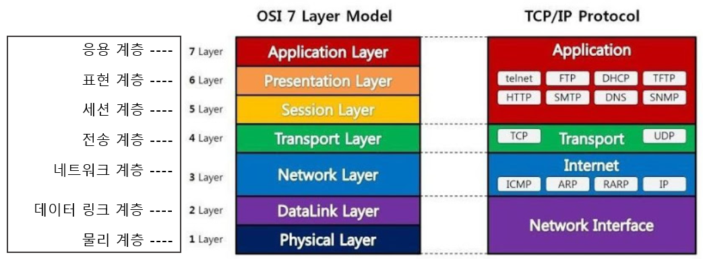
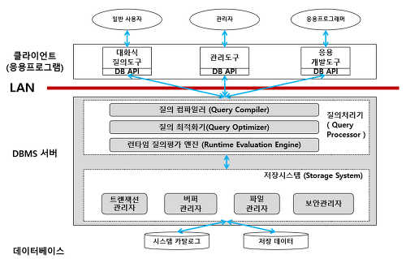

### ⭐ 참고
[[개발자 장고] 개발자 전공면접 준비 YOUTUBE](https://www.youtube.com/watch?v=SiObpQCTyFQ&list=PLi-xJrVzQaxU-xK2ao8utngQJqAX4DQty)

 

### ☑️ 네트워크
1. OSI 7계층
   - 네트워크에서 통신이 일어나는 과정을 7단계로 나눈 것
   - 특정한 곳에 이상이 생기면 다른 단계의 장비 및 소프트웨어를 건드리지 않고 이상이 생긴 단계만 고칠 수 있다.
      
      
이미지 출처 : <a href="https://velog.io/@xldksps4/OSI-7%EA%B3%84%EC%B8%B5">OSI 7계층</a>

     - 응용 계층 (Applycation Layer)
       - HTTP, FTP, SMTP, POP3, IMAP, Telnet 등과 같은 프로토콜 존재
       - 응용 프로세스와 직접 관계하여 일반적인 응용 서비스 수행
       - 네트워크 소프트웨어 UI 부분, 사용자의 입출력(I/O) 부분
     - 표현 계층 (Presentation Layer)
       - 데이터 표현이 상이한 응용 프로세스의 독립성을 제공하고 암호화 한다.
       - MIME 인코딩이나 암호화 등의 동작
       - 사용자의 명령어를 완성 및 결과 표현/포장/압축/암호화
     - 세션 계층 (Session Layer)
       - 데이터가 통신하기 위한 논리적인 연결
       - 세션 설정, 유지, 종료, 전송 중단시 복구 등의 기능
       - 양 끝단의 응용 프로세스가 통신을 관리하기 위한 방법 제공
       - 동시 송수신 방식(duplex), 반이중 방식(half-duplex), 전이중 방식(Full Duplex)의 통신과 함께 체크 포인팅과 유휴, 종료, 다시 시작 과정 등을 수행
       - TCP/IP 세션을 만들고 없앰
     - 전송 계층 (Transport Layer)
       - TCP 프로토콜 등을 이용해 포트를 열어 응용프로그램들이 전송할 수 있게 함
       - 패킷 생성 및 전송
     - 네트워크 계층 (Network Layer)
       - 데이터를 목적지까지 가장 안전하고 빠르게 전달하는 기능(라우팅)
       - 경로를 선택하고 주소를 정해(IP) 패킷을 전달
       - 라우팅, 흐름 제어, 세그멘테이션(segmentation/desegmentation), 오류 제어, 인터네트워킹(Internetworking) 등 수행
       - 라우터, Layer(스위치+라우터)
     - 데이터 링크 계층 (DataLink Layer)
       - 물리 계층을 통해 송수신되는 정보의 오류와 흐름을 관리하여 안전한 정보의 전달을 수행
       - 맥 주소를 가지고 통신
       - 단위 : 프레임
       - 장비 : 브리지, 스위치
     - 물리 계층 (Physical Layer)
       - 전기적, 기계적, 기능적인 특성을 이용해서 통신 케이블로 데이터 전송
       - 단위 : 비트
       - 장비 : 통신 케이블, 리피터, 허브
     
출처 : <a href="https://shlee0882.tistory.com/110">OSI 7 계층이란?, OSI 7 계층을 나눈 이유</a>

    ✏️ OSI 7 계층은 인터넷 환경에서 통신하기 위해 네트워킹에 대한 표준을 7계층으로 나눈 것입니다. 물리 계층, 데이터 링크 계층, 네트워크 계층, 전송 계층, 세션 계층, 표현 계층, 응용 계층이 있습니다.

2. TCP, UDP
   - TCP(Transmission Control Protocol)
     - 신뢰성(상대방이 받았는지 확인 가능)이 높은 프로토콜, 느림
     - 연결형 프로토콜이며, 연결이 성공해야 통신이 가능하다.
     - 연결의 설정(3-way handshaking)과 해제(4-way handshaking)
     - 데이터 흐름 제어(수신자 버퍼 오버플로우 방지) 및 혼잡 제어(네트워크 내 패킷 수가 과도하게 증가하는 현상 방지)
   - UDP(User Datagram Protocol)
     - 빠른 프로토콜, 신뢰성이 낮음
     - 비연결형 프로토콜이며, 연결 없이 통신이 가능하다.
     - 데이터 재전송과 데이터 순서 유지를 위한 작업을 하지 않음
     - 1 대 1 통신(unicast), 1 대 다 통신(broadcast), 다 대 다 통신(multicast)

    ✏️ TCP는 높은 신뢰성을 보장하지만 UDP보다 속도가 느립니다. 3way, 4way handshake로 서버와 클라이언트가 1:1 통신을 하며, 흐름 제어와 혼잡 제어가 이루어집니다. UDP는 비연결형 프로토콜로 손상된 데이터에 대해 재전송하지 않습니다. 신뢰성은 낮지만 TCP보다 속도가 빨라 스트리밍 서비스에 주로 이용됩니다.

3. IP(Internet Protocol)
   - 인터넷에서 데이터를 전달하는 프로토콜
   - 네트워크에서 호스트들과 통신할 수 있는 주소 값
   - 비신뢰성 : 보낸 데이터의 흐름에 관여하지 않기 때문에 보낸 패킷이 제대로 갔는지 보장하지 않는다. → 신뢰성 보장 프로토콜은 ICMP
   - 비연결성 : 패킷을 받을 대상이 연결 상태임을 확인하지 않고 전송하기 때문에 받을 대상(호스트)이 서비스 불능 상태여도 패킷이 전송됨

    ✏️ IP는 인터넷 프로토콜의 약자로 인터넷 망을 통해 패킷을 전달하는 프로토콜입니다. 비연결성과 비신뢰성의 특징을 가지는데, 비연결성은 패킷을 받을 대상이 연결 상태임을 확인하지 않고 전송하는 것이고, 비신뢰성은 보낸 패킷이 제대로 갔는지 보장하지 않는 것 입니다.

4. DNS란?
   - 도메인 주소를 IP 주소로 변환해주는 시스템
    
    
이미지 출처 : <a href="https://xn--3e0bx5euxnjje69i70af08bea817g.xn--3e0b707e/jsp/resources/dns/dnsInfo.jsp">한국인터넷정보센터</a>

    ✏️ DNS는 도메인 주소를 IP 주소로 변환해주는 시스템입니다. 첫 번째 URL을 입력하면, ISP가 관리하는 DNS 해석기에 요청을 라우팅시킵니다. 그 다음에 DNS 해석기 root 서버에 top-level의 서버 주소를 요청하고, top-level에서 second-level, second-level에서 sub DNS server에 요청하여 최종 IP 주소를 얻게 됩니다.

5. 로드밸런서란?
   - 서버의 부하를 분산시켜주는 시스템
   - L4 : Transport 계층을 사용, Port 기반 부하 분산
   - L7 : Application 계층을 사용, 요청(URL) 기반 부하 분산

    ✏️ 로드밸런서는 서버의 부하를 분산시켜주는 시스템입니다. 크게 L4 로드밸런서와 L7 로드밸런서가 있는데, L4 로드밸런서는 MAC 주소, IP 주소, 포트정보(4계층 이하)를 가지고 트래픽을 분산해줍니다. L7 로드밸런서는 패킷 내용(7계층)을 확인하고 분산하여 DDoS 같은 비정상적인 트래픽을 필터링 할 수 있습니다.

 

### ☑️ 데이터베이스
1. DBMS
   - 데이터베이스 내 데이터에 접근하도록 도와주는 시스템
    
    
이미지 출처 : <a href="https://hading.tistory.com/10">Chaper 3 데이터베이스 시스템의 구성</a>

   - 질의처리기 : Query 해석 및 기계어로 변경, 캐싱
   - 저장시스템

    ✏️ 데이터베이스 내 데이터에 접근하도록 도와주는 시스템입니다. 크게 질의처리기와 저장시스템으로 이루어져 있습니다. 

2. 트랜잭션 특징 ACID
   - 원자성(Atomicity)
     - 트랜잭션의 작업이 부분적으로 실행되거나 중단되지 않는 것을 보장
     - All or Notnig의 개념으로 작업 단위를 일부분만 실행하지 않는 것
   - 일관성(Consistency)
     - 트랜잭션이 성공적으로 완료되면 일관적인 DB 상태 유지
   - 격리성(Isolation)
     - 트랜잭션 수행 시 다른 트랜잭션의 작업이 끼어들지 못하도록 보장
   - 지속성(Durability)
     - 성공적으로 수행된 트랜잭션은 영원히 반영

    ✏️ 데이터베이스의 무결성(데이터의 정확성, 일관성, 유효성 유지)을 유지하기 위해 트랜잭션은 4가지 특징을 만족해야 합니다. 원자성은 한 트랜잭션 내 실행한 작업은 모두 성공하거나 실패해야 하는 것입니다. 일관성은 일관적인 데이터베이스 상태를 유지하는 것입니다. 격리성은 트랜잭션은 서로 영향을 미치지 않아야 합니다. 지속성은 트랜잭션 완료시 결과가 영구적으로 반영되어야 합니다.

3. NOSQL
   - Not Only SQL의 약자로, SQL을 보완한다는 의미
   - SQL(보통 RDBMS)과 NOSQL의 가장 큰 차이는 스키마의 유무와 관계
   - 스키마란? 데이터를 저장하는 규칙

    ✏️ NOSQL은 Not Only SQL의 약자로, SQL을 보완한다는 의미를 가지고 있습니다. NOSQL은 스키마가 없어 데이터를 조회하고 삽입하는 속도가 빠르며, 대량의 분산 데이터를 저장하는데 특화되어 있습니다.

4. 파티셔닝(Partitioning)
   - 테이블을 컬럼 단위로 나누어 관리하는 기법
   - 데이블의 일부 열을 빼내는 형태로 분할

    ✏️ 테이블을 컬럼 단위로 나누어 관리하는 기법으로 장점은 update나 insert 같은 작업이 분산되어 성능이 향상됩니다. 단점은 테이블 간 join 비용이 증가하고, index를 별도로 파티셔닝 할 수 없다는 것입니다.

5. 샤딩(Sharding)
   - 테이블을 row 단위로 분산하여 저장하는 방법
   - Shard Key를 어떻게 정의하느냐에 따라 데이터를 효율적으로 분산시키는 것이 결정
     - Hash Sharding : Database id를 Hashing 하여 결정, 데이터가 많아질 경우 확장이 어려움
     - Dynamic Sharding : 범위를 정해 데이터 저장, 확장이 쉬움

    ✏️ 테이블을 row 단위로 분산해서 저장하는 방법입니다. Horizontal Partitioning 이라고도 하는데, Shard Key를 정의하는 방법에 따라 종류가 결정되는데, 크게 Hash Sharding과 Dynamic Sharding이 있습니다.