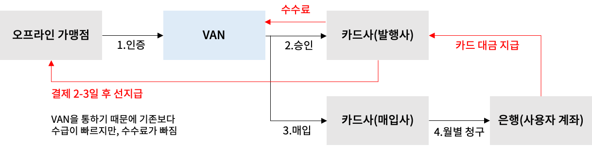
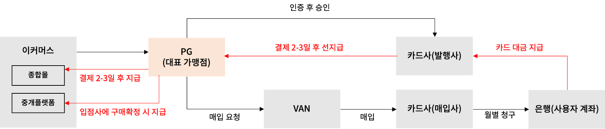
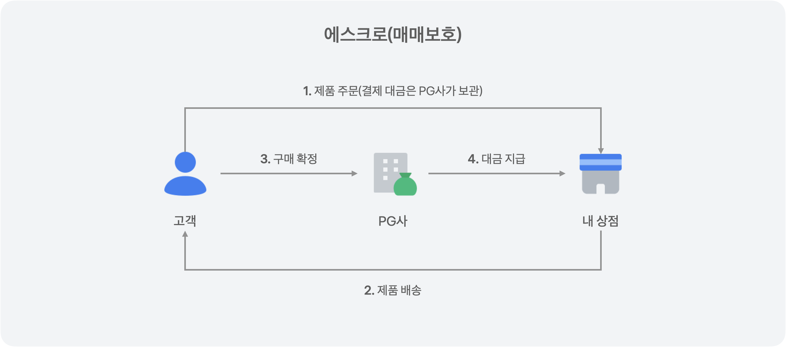

<style>
b {
    color: #F8A4AE;
}
</style>

⭐ 간단한 정리만 되어있으므로 자세한 내용은 따로 공부해야 합니다.

### ☑️ PG와 VAN
1. <b>VAN(Value Added Network)</b>
   - 카드사와 상점의 통신을 연결하는 부가가치통신망
   - 데이터를 안전하고 정확하게 연결해주는 역할 (전자금융보조업자)
   - 카드사별 단말기를 하나로 통합하여 가맹점에게 통합 단말기를 제공해주고 카드사와 가맹점 사이의 계약과 거래를 도와준다. (단말기를 통한 승인 중계 업무)
   - 카드 매출 데이터를 정리하고 금융기관을 대신하여 카드 전표 매입 업무를 담당
   - 카드사로부터 수수료를 받는다. (카드사와 계약)
  
      - 인증 : 오프라인 가맹점에서 단말기에 카드를 긁을 때, 유효한 카드라면 인증이 완료된다.
      - 승인 : VAN사는 카드 정보를 카드사(발행사)에 보내 한도를 확인하고, 남아있을 경우 승인한다. (한도만 차감)
      - 매입 : VAN사는 승인된 내역을 일 1회 카드사(매입사)에 보낸다.
      - 청구 : 카드사(매입사)는 매입된 정보들을 바탕으로 구매자에게 청구한다.

1. <b>PG(Payments Gateway)</b>
   - 신용카드사와 직접 계약하기 어려운 온라인 쇼핑몰을 대신해 결제 업무를 대신해 주는 역할 (전자지급결제대행업)
   - 여러 곳의 카드사와 결제 데이터를 안정적으로 주고 받는 것 뿐만 아니라 매출 정산 서비스도 제공 (전자금융업자)
   - 대표 가맹점 역할로 PG사 밑에 수많은 가맹점이 존재한다.(가맹점이 많아질수록 수수료 부담이 적어진다.)
   - VAN사와 카드사는 대표 가맹점(PG사) 정보만 알 수 있다.
   - 가맹점에게 수수료를 받는다. (가맹점과 계약)
   

<p style="font-size:12px; text-align:center">출처 : <a href="https://blog.tossbusiness.com/articles/semo-16">PG와 VAN 무엇이 다를까?</a>, <a href="https://dabinlee.tistory.com/20">결제 시스템 : VAN, PG, 간편 결제 서비스</a></p>

### ☑️ 에스크로(Escrow)
- 고객에 온라인으로 제품을 구매할 때 지불한 돈을 PG사와 같은 제 3자가 보관했다가 구매확정 후 가맹점에게 돈을 지급하는 시스템
- 결제대금예치 서비스, 매매보호 서비스, 구매안전 서비스
  
  <p style="font-size:12px; text-align:center">출처 : <a href="https://docs.tosspayments.com/resources/glossary/escrow">토스페이먼츠 개발자센터 용어사전 - 에스크로</a></p>

### ☑️ AES(Advanced Encryption Standard)
- 대칭 암호화 알고리즘
- 데이터 암호화 표준(DES, Data Encryption Standard)를 대체하기 위해 선정
  - 대칭 키 블록 암호화 방식
  - 64비트 크기
- 128비트 고정 블록 크기를 사용하지만, 128, 192 또는 256비트의 키 크기를 지원한다.
- 사용
  - 네트워크 보안 : SSL/TLS 프로토콜에서 데이터 암호화
  - 무선 보안 : Wi-Fi Protected(WPA)와 WPA2
  - 파일 및 디스크 암호화
  - 클라우드 서비스
  - 전자정부

  <p style="font-size:12px; text-align:center">출처 : <a href="https://onecoin-life.com/73">AES(Advanced Encryption Standard) 개념, 원리, 장단점 총저리</a></p>

### ☑️ I/F 서버(Interface Server)
- 시스템 간의 통신이나 교환을 가능하게 하는 서버
- 여러 개의 서버와 시스템이 동시에 운영될 때, 이들이 서로 원활하게 통신하고 데이터를 주고받을 수 있게 함
- 통신 프로토콜, 데이터 형식, 보안 규정 등을 관리하고, 요청된 작업을 적절한 시스템 또는 서비스로 라우팅

### ☑️ Map 전체 출력
1. <b>entrySet</b>
  ```java
    Map<String, String> map = new HashMap<String, String>();
    map.put("key1", "value1");
    map.put("key2", "value2");
    for(Map.Entry<String, String> entry : map.entrySet()){
      System.out.println("Key : " + entry.getKey() + ", Value : " + entry.getValue());
    }
  ```
  ```java
    map.entrySet().stream().forEach(entry -> {
      System.out.println("Key : " + entry.getKey() + ", Value : " + entry.getValue());
    });
  ```

2. <b>keySet</b>
  ```java
    for(String key : map.keySet()){
      System.out.println("Key : " + key + ", Value : " + map.get(key));
    }
  ```
  ```java
    map.keySet().stream().forEach(key -> {
      System.out.println("Key : " + key + ", Value : " + map.get(key));
    });
  ```
3. <b>Lambda</b>
  ```java
    map.forEach((key, value) -> {
      System.out.println("Key : " + key + ", Value : " + value);
    });
  ```
<p style="font-size:12px; text-align:center">출처 : <a href="https://tychejin.tistory.com/31">[Java] Map 전체 출력(entrySet, keySet, Iterator, Lambda, Stream)</a></p>

### ☑️ String
1. <b>isEmpty()</b>
   - java 6 이후
   - 문자열의 길이가 0인 경우에 true
   - 빈 공백이 있으면 false
2. <b>isBlank()</b>
   - java 11 이후
   - 문자열이 비어 있거나, 빈 공백으로만 이루어져 있으면 true
    <p style="font-size:12px; text-align:center">출처 : <a href="https://hianna.tistory.com/531">[Java] isEmpty() 와 isBlank()의 차이</a></p>
3. <b>valueOf()</b>
   - Object의 값을 String으로 변환
   - Object가 null이면 "null" 반환
   - null 체크시 `"null".equals(string)`으로 체크
4. <b>toString()</b>
   - Object의 값을 String으로 변환
   - Object가 null이면 NullPointerException(NPE) 발생
   - NPE를 방지하기 위해 `valueOf` 추천
    <p style="font-size:12px; text-align:center">출처 : <a href="https://swjeong.tistory.com/146">[Java] toString()과 String.valueOf()의 차이점</a></p>

### ☑️ HttpServletResponse 응답상태코드
1. <b>1xx : 정보</b>
- `SC_CONTINUE` : 100
- `SC_SWITCHING_PROTOCOLS` : 101
2. <b>2xx : 성공</b>
- `SC_OK` : 200, 성공
- `SC_CREATED` : 201, 새로운 리소스 생성
- `SC_ACCEPTED` : 202
- `SC_NON_AUTHORITATIVE_INFORMATION` : 203
- `SC_NO_CONTENT` : 204
- `SC_RESET_CONTENT` : 205
- `SC_PARTIAL_CONTENT` : 206
3. <b>3xx : 리다이렉션</b>
- `SC_MULTIPLE_CHOICES` : 300
- `SC_MOVED_PERMANENTLY` : 301, 새 URL 제공(영구적 이동)
- `SC_MOVED_TEMPORARILY` : 302, 요청한 URL이 일시적으로 변경
- `SC_SEE_OTHER` : 303
- `SC_NOT_MODIFIED` : 304
- `SC_USE_PROXY` : 305
4. <b>4xx : 클라이언트 오류</b>
- `SC_BAD_REQUEST` : 400, 서버가 요청 구문 이해 못함
- `SC_UNAUTHORIZED` : 401, 인증이 필요한 페이지
- `SC_PAYMENT_REQUIRED` : 402
- `SC_FORBIDDEN` : 403
- `SC_NOT_FOUND` : 404, 요청한 페이지를 찾을 수 없음
- `SC_METHOD_NOT_ALLOWED` : 405
- `SC_NOT_ACCEPTABLE` : 406
- `SC_PROXY_AUTHENTICATION_REQUIRED` : 407
- `SC_REQUEST_TIMEOUT` : 408
- `SC_CONFLICT` : 409
- `SC_GONE` : 410
- `SC_LENGTH_REQUIRED` : 411
- `SC_PRECONDITION_FAILED` : 412
- `SC_REQUEST_ENTITY_TOO_LARGE` : 413
- `SC_REQUEST_URI_TOO_LONG` : 414
- `SC_UNSUPPORTED_MEDIA_TYPE` : 415
5. <b>5xx : 서버 오류</b>
- `SC_INTERNAL_SERVER_ERROR` : 500, 서버 오류 발생
- `SC_NOT_IMPLEMENTED` : 501
- `SC_BAD_GATEWAY` : 502
- `SC_SERVICE_UNAVAILABLE` : 503
- `SC_GATEWAY_TIMEOUT` : 504
- `SC_HTTP_VERSION_NOT_SUPPORTED` : 505

  <p style="font-size:12px; text-align:center">출처 : <a href="https://m.blog.naver.com/tyboss/70021916490">[서블릿]HttpServletResponse 인터페이스</a></p>

### ☑️ @RequestMapping의 consumes와 produces
1. <b>consumes</b>
   - 들어오는 데이터 타입을 정의 (요청의 미디어 타입)
   - HTTP 헤더의 Content-Type에 따라 다른 Controller method를 실행시킬 수 있다.
2. <b>produces</b>
   - 반환하는 데이터 타입을 정의 (응답의 미디어 타입)
   - HTTP 헤더의 Accept에 따라 다른 Controller method를 실행시킬 수 있다.
   
   <p style="font-size:12px; text-align:center">출처 : <a href="https://jaehoney.tistory.com/297">Spring - consumes와 produces 이해하기!</a></p>

### ☑️ WAS(Web Application Server)
1. <b>Tomcat</b>
   - 가장 널리 사용되는 오픈소스 WAS
   - 스프링 부트에서 기본 내장 WAS로 설정
   - 서블릿 컨테이너라고도 불리며, JSP와 Servlet 지원
   - 간단한 웹 애플리케이션부터 대규모 엔터프라이즈 시스템까지 사용
   - 높은 안정성, 확장성, 편리한 관리 도구, 커뮤니티를 통한 풍부한 지원
   - Full Profile Java EE를 지원하지 않아 EJB나 JMS 등의 기능을 사용하려면 추가적인 설정 필요
2. <b>Jetty</b>
   - 적은 메모리를 사용하여 가볍고 빠르다.
   - 규모가 있는 프로젝트에 적용하기에는 무리
   - 임베디드 서버로서의 활용도가 높음, 웹 소켓 등 최신 기술에 대한 지원이 뛰어남
   - Tomcat에 비해 커뮤니티 지원이 부족하고, Full Profile Java EE 지원 안함
3. <b>Netty</b>
   - Async, Event-Driven 방식의 네트워크 애플리케이션 프레임워크
   - Spring WebFlux에서 기본 내장 WAS
   - 고성능, 고유연한 네트워크 애플리케이션 개발에 주로 사용
   - 고성능과 비동기 처리에 최적화, 다양한 프로토콜 지원
   - 사용 방법이 복잡하고 학습 곡선이 다소 높음
4. <b>Undertow</b>
   - Netty 기반
   - 경량화된 웹 서버로 임베디드 사용에 적합
   - Servlet 3.1, WebSocket 1.1 등 지원
   - 대규모 트래픽으로부터 Tomcat보다 안정적, Servlet과 네이티브 비동기 I/O를 모두 지원
   - 커뮤니티 지원이 다소 부족

  <p style="font-size:12px; text-align:center">출처 : <a href="https://hyojaedev.tistory.com/32">Undertow 적용하기 (다른 WAS 적용해보기)</a>, ChatGPT</p>

### ☑️ X-Forwarded-For (XFF) 헤더
- HttpServletRequest 객체 내 함수로 클라이언트 IP를 가져온다.
- `getRemoteAddr()`은 방화벽이나 클라우드로 운영하는 경우 클라이언트의 원 IP 주소를 가져올 수 없다. (프록시나 로드 밸런서의 IP 주소만을 가지고 있다.)
- `X-Forwarded-For` 헤더는 HTTP 프록시나 로드 밸런서를 통해 웹 서버에 접속하는 클라이언트의 원 IP 주소를 식별하는 표준 헤더이다.
- 일반적으로 많이 쓰이지만 프로젝트마다 서버 환경이나 프록시 등 중개서버가 다르기 때문에 여러 헤더를 체크해야 할 수도 있다.
<p style="font-size:12px; text-align:center">출처 : <a href="https://linked2ev.github.io/java/2019/05/22/JAVA-1.-java-get-clientIP/">[Java] 1. 클라이언트 실제 접속 IP 가져오기</a></p>